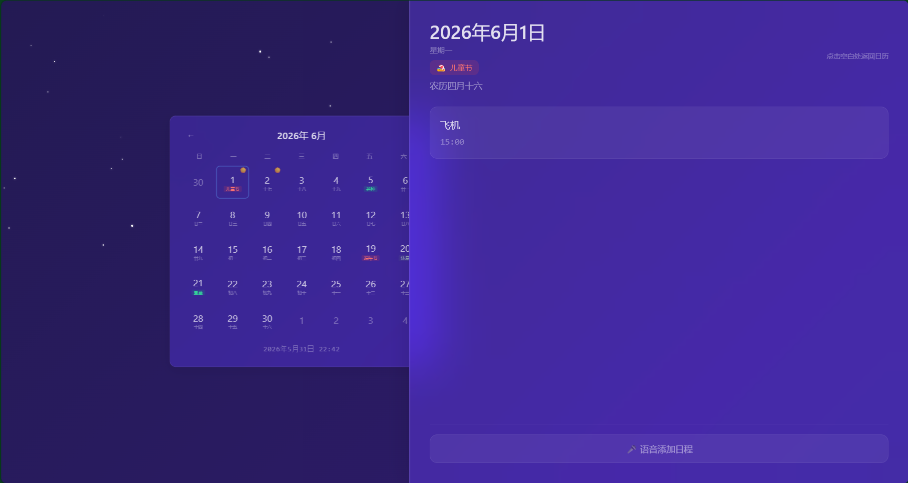

# 语音日历助手 Voice Calendar Agent

以语音交互为核心的日历管理工具：通过语音添加、删除、查询日程，由大模型把口语解析成「操作 + 时间 + 标题 + 提醒」，存入本地数据库并按时提醒。配有一套 Vue 单页 Web 界面，集成农历、节假日 / 节气与实时天气背景。

技术栈：Python 3.11+、uv、FastAPI、SQLite、百度语音（在线 ASR）、DeepSeek（NLU）、Vue 3。

### web页面展示：

---
### demo视频链接：
通过网盘分享的文件：语音助手.mov
链接: https://pan.baidu.com/s/17FYjyAflv3zEWfxyEJombw?pwd=1234 提取码: 1234 
--来自百度网盘超级会员v3的分享
### 部署上线体验：
https://139.196.59.150:8000


## 目录

- [项目目标](#项目目标)
- [功能特性](#功能特性)
- [完整度说明](#完整度说明)
- [创新点](#创新点)
- [原创功能边界](#原创功能边界)
- [技术架构](#技术架构)
- [核心流程](#核心流程)
- [数据模型](#数据模型)
- [第三方依赖](#第三方依赖)
- [代码目录](#代码目录)
- [本地运行](#本地运行)
- [配置说明](#配置说明env)
- [生产部署](#生产部署)
- [示例](#示例)
- [测试](#测试)
- [代码规范](#代码规范)
- [Roadmap](#roadmap)

## 项目目标

传统日历应用主要靠手动点选和逐字输入，记一条日程常常要切换界面、填好几个字段，在通勤、走路、开会间隙等不方便操作的场景下效率较低。

本项目以语音交互为核心，目标是做一个能提升日历管理效率的工具：用户说一句话（例如「明天下午三点开会，提前半小时提醒我」），系统就能完成事件的添加、删除、查询和提醒。

具体要解决三个问题：

- 免动手：用语音代替点选和打字；
- 听得懂：用大模型解析口语，自动换算「明天」「下周三」「三点一刻」等相对时间，并纠正语音识别中的同音字；
- 信息全：Web 界面整合农历、节假日 / 节气和实时天气，方便查看。

## 功能特性

- 语音操作日程：一句话完成添加、删除、查询。
- 大模型自然语言理解：把「明天下午3点一刻开会，提前半小时提醒」解析成结构化日程，自动换算相对时间。
- 同音字纠正：如「回忆 / 会意」纠正为「会议」，应对语音识别误差。
- 农历、节假日、节气：日期格三层显示（公历数字 / 农历与特殊日期标签 / 事件标记），覆盖 2026 全年特殊日期。
- 实时天气背景：12 种天气按昼夜切换渐变，含雨、雪、星空、闪电等粒子动画。
- 定时提醒：提醒函数已实现，接入主程序运行为进行中。
- 多种使用方式：Web 界面、终端交互、HTTP API。

## 完整度说明

| 模块 | 状态 | 说明 |
|------|------|------|
| 语音识别（在线） | 已完成 | 百度语音（baidu-aip），当前唯一识别引擎 |
| 语音识别（离线） | 规划中 | 尚未实现，后续拟接入 Vosk |
| NLU 解析 | 已完成 | DeepSeek，含同音字纠正、时间段解析 |
| 事件增删查 | 已完成 | REST 接口 + 语音 /execute |
| 定时提醒 | 部分完成 | 提醒函数已实现，尚未接入主程序运行 |
| Web 前端 | 已完成 | 农历 / 特殊日期 / 天气背景 |
| 桌面 GUI | 规划中 | 当前未实现，后续拓展方向（保留 PyQt6 可选依赖） |

## 创新点

1. 语音到结构化指令的完整链路。不只是语音转文字，而是把口语解析成 `{操作, 标题, 时间, 提醒}` 的结构化指令并落库执行。提示词中注入当前时间作为锚点，让模型把相对时间换算成 ISO8601 绝对时间。

2. 针对语音场景的同音字纠正。在提示词里对日历高频词做同音字纠错（如「回议 / 会意」纠正为「会议」、「灰机」纠正为「飞机」），降低语音识别误差对下游解析的影响。

3. 农历、节气、节假日、天气的整合。日期格分三层显示（公历 / 农历与特殊日期 / 事件标记），背景按 12 种天气和昼夜变化切换，昼夜依据 wttr.in 返回的日出日落数据判断。

4. 前端录音 + 服务端 ffmpeg 转码。浏览器用 MediaRecorder 录 webm/opus，服务端用 ffmpeg 转成 16kHz 单声道 PCM WAV 再交给百度 ASR。配合 fsync 刷盘、EBML 魔数校验、0.8 秒最短录音等处理，解决真实部署中的音频格式和时序问题。

5. 自带 HTTPS 部署。内置自签名证书生成（`--ssl`），解决浏览器麦克风要求安全上下文的部署问题。

## 原创功能边界

| 类别 | 内容 |
|------|------|
| 自研 | NLU 提示词设计（时间锚点 + 同音字纠正 + time_range + JSON 约束）；/execute 语音指令到事件的匹配执行逻辑（空标题为当天全部、精确优先、双向模糊）；CalendarService 业务逻辑与时间窗口查询；天气背景三层层叠与多级降级链；特殊日期数据（58 条）与日期格三层展示；录音健壮性处理（fsync / EBML 校验 / 0.8 秒最短）；--ssl 自签名证书部署；整体前后端集成 |
| 第三方 | FastAPI、Uvicorn、SQLAlchemy、pydantic（框架与库）；baidu-aip（百度语音识别 API）；DeepSeek / Anthropic（大模型 API）；wttr.in（天气数据源）；Vue 3、Tailwind CSS、tinylunar（前端）；ffmpeg（音频转码） |

## 技术架构

分为五层，外加入口与工具。

```
前端层  frontend/web/index.html (Vue3 CDN + Tailwind, 约 1050 行)
  日历月视图 / 农历(tinylunar) / 特殊日期 / 天气背景 / 录音(MediaRecorder)
        │  HTTP / WebSocket（同源，无需 CORS）
API 层  FastAPI  (src/voice_calendar_agent/backend/api/)
  events.py   事件 REST CRUD + /execute 语音指令执行
  voice.py    /upload(含 ffmpeg 转码) / /parse / /stream(WS)
  weather.py  /api/weather（wttr.in 代理 + 缓存）
        │  单例 get_*_service()
核心服务层  (backend/core/)
  voice_service.py     语音识别封装（当前：百度在线）
  nlu_service.py       大模型解析（DeepSeek，输出 ISO8601 + 同音字纠正）
  calendar_service.py  事件增删查改业务逻辑
        │  SQLAlchemy Session
数据层  (backend/models/)
  database.py  引擎 / 会话 / init_db()
  event.py     ORM 映射
  SQLite，文件 data/calendar.db

外部能力：百度 ASR(在线) / DeepSeek LLM / wttr.in 天气 / ffmpeg(系统)
入口工具：main.py(终端 / --api / --ssl) / config.py(Settings) / utils/ssl_helper.py
```

分层说明：

- 前端层：单文件 Vue 应用，CDN 引入 Vue3 与 Tailwind，无构建步骤；负责录音、日历渲染、农历 / 特殊日期 / 天气展示。由 FastAPI 以静态文件方式挂载，根路由返回 index.html，与后端同源，因此不需要配置 CORS。
- API 层：FastAPI 路由。events.py 既提供标准 REST（/api/events 增删查改），又提供 /api/execute 执行 NLU 解析后的语音指令；voice.py 处理音频上传、格式转码与识别；weather.py 代理天气数据。
- 核心服务层：纯业务逻辑，不依赖 Web 框架，便于单测。ASR、NLU、日历三块解耦，通过单例 get_*_service() 获取。
- 数据层：SQLAlchemy + SQLite，同步会话，每请求新建。
- 入口工具：main.py 是统一入口（终端默认、--api 起服务、--ssl 启 HTTPS）。

核心层在结构上为 ASR 路由预留了扩展位，当前仅百度在线已落地；离线 Vosk 见 Roadmap。

## 核心流程

语音指令全链路（添加、删除、查询通用）：

```
浏览器                         后端 FastAPI                      外部
 1. MediaRecorder 录音(webm/opus, >=0.8s)
 -- POST /api/voice/upload --> 2. fsync 刷盘 + EBML 魔数校验
                               3. ffmpeg 转 16kHz 单声道 PCM WAV
                               4. ----------------------> 百度 ASR
 <------- 文本 -------------    <------------------------- 识别文本
 -- POST /api/voice/parse -->  5. ----------------------> DeepSeek
 <-- {intent,title,time,...}   <------------------------- JSON
 -- POST /api/execute ------>  6. CalendarService -> SQLite (增/删/查)
 <------- 执行结果 ---------
 7. 前端刷新月视图 GET /api/events?date=...&range=month
```

要点：

1. 录音健壮性：fsync 强制刷盘 + EBML 魔数校验（1A 45 DF A3）+ 空文件拒绝 + 前端 0.8 秒最短录音，避免半截或空音频送进 ffmpeg 失败。
2. 格式转码：浏览器录的是 webm/opus，百度 ASR 只收 pcm/wav/amr，所以服务端用 ffmpeg 转成 16kHz 单声道 PCM WAV。
3. 相对时间换算：NLU 提示词注入当前时间和今天周几，让模型把相对时间换算成 ISO8601；后端用 datetime.fromisoformat 转换。
4. 指令执行：/execute 按 intent 分发。添加直接落库；删除按「空标题为当天全部 / 精确优先 / 双向模糊」匹配；查询按 time_range（上午 / 下午 / 晚上）过滤。

前端状态机：

```
HOME --点击日期--> SCHEDULE --点击空白--> HOME
                     |
                点其他日期 -> 刷新该日日程

HOME --点击录音--> RECORDING --停止--> 上传 -> 解析 -> 执行 -> 回到 HOME 并刷新
```

天气背景旁路流程（不阻塞主链路）：

```
geolocation 允许 -> 用本地坐标查天气
       | 拒绝或超时
不传坐标 -> 默认北京 -> wttr.in -> 失败则返回旧缓存 -> 再不行返回默认晴天
                               |
   前端按 body[data-weather-category][data-daynight] 切换渐变和粒子
```

## 数据模型

SQLite，表 events，文件 data/calendar.db。

| 字段 | 类型 | 说明 |
|------|------|------|
| id | INTEGER | 主键，自增 |
| title | VARCHAR(200) | 事件标题 |
| description | TEXT | 描述（可空） |
| start_time | DATETIME | 开始时间 |
| end_time | DATETIME | 结束时间（可空） |
| reminder | BOOLEAN | 是否提醒 |
| reminder_minutes | INTEGER | 提前提醒分钟数 |
| created_at | DATETIME | 创建时间 |
| updated_at | DATETIME | 更新时间 |

## 第三方依赖

系统依赖（非 pip，需自行安装）：

| 工具 | 用途 | 安装 |
|------|------|------|
| ffmpeg | 音频转码（webm/opus 转 16kHz PCM WAV） | `sudo apt install ffmpeg` / `brew install ffmpeg` / `winget install ffmpeg`。不在 PATH 时可在 .env 设 FFMPEG_PATH |

主依赖（pyproject.toml 的 [project].dependencies）：

| 库 | 用途 |
|----|------|
| fastapi / uvicorn[standard] | Web 框架与 ASGI 服务器 |
| python-dotenv / pydantic-settings / pydantic | 配置加载与数据校验 |
| baidu-aip | 百度语音识别（在线 ASR，当前唯一识别引擎） |
| websocket-client | 语音流 / 外部连接 |
| sqlalchemy / aiosqlite | ORM 与 SQLite 驱动 |
| openai / anthropic / httpx | 大模型调用（DeepSeek 走 openai 兼容格式） |
| python-multipart | 文件上传（音频） |
| chardet | 文本编码探测 |
| cryptography | --ssl 自签名证书生成 |
| pyaudio | 仅离线 Vosk（规划中）需要；Web 录音已由浏览器完成，服务端用不到，建议从主依赖删除 |

可选依赖组（uv sync --extra 组名）：

| 组 | 内容 | 用途 |
|----|------|------|
| dev | pytest, pytest-asyncio/cov/mock, black, isort, ruff | 测试与代码质量 |
| gui | PyQt6 | 桌面 GUI（规划中，后续拓展方向） |
| vosk | vosk, pyaudio | 离线识别（规划中，尚未实现；不支持 macOS ARM64） |

关于 pyaudio：它现在在主依赖里，但 Web 端录音已由浏览器完成、服务端用不到，且它在 Linux 上需要系统库 PortAudio、会拖累部署安装。vosk 可选组里已经包含 pyaudio，因此建议直接从主依赖删除 pyaudio，将来做离线 Vosk 时用 uv sync --extra vosk 即可。

## 代码目录

```
voice-driven-calendar/
├── main.py                  启动入口：--terminal / --api / --ssl
├── pyproject.toml           项目与依赖配置（hatchling 构建）
├── uv.lock                  依赖锁定
├── .env.example             配置模板
├── .python-version          Python 版本固定（3.11）
├── setup.py                 环境检查：python setup.py [--fix]
├── clean.py                 端口清理；--reset 删库
├── addData.py               注入测试数据：NLU 模式 / --direct 直调 API
├── data/
│   ├── calendar.db          SQLite 数据库（运行时生成）
│   └── ssl/                 自签名证书（--ssl 生成）
├── doc/                     开发文档 / 开发日志
├── tests/
│   ├── unit/                单元：calendar_service、nlu_service
│   ├── integration/         集成：语音识别 API
│   └── conftest.py          测试夹具（db_session、TestClient）
└── src/voice_calendar_agent/
    ├── __main__.py          委托 main.py
    ├── app.py               FastAPI 应用（create_app + StaticFiles + 根路由）
    ├── config.py            配置加载（pydantic-settings）
    ├── backend/
    │   ├── api/
    │   │   ├── events.py    事件 REST CRUD + /execute 语音指令执行
    │   │   ├── voice.py     /upload(ffmpeg 转码) / /parse / /stream(WS)
    │   │   └── weather.py   /api/weather（wttr.in 代理 + 缓存）
    │   ├── core/
    │   │   ├── calendar_service.py   事件增删查改业务逻辑
    │   │   ├── nlu_service.py        大模型解析（DeepSeek，ISO8601 + 同音字纠正）
    │   │   └── voice_service.py      语音识别封装（当前：百度在线）
    │   └── models/
    │       ├── database.py  SQLAlchemy 引擎与会话 / init_db()
    │       └── event.py     事件 ORM 模型
    ├── frontend/
    │   └── web/
    │       ├── index.html   Vue3 + Tailwind 单文件应用（约 1050 行）
    │       └── static/
    │           ├── js/special_dates.js   58 条特殊日期（节假日/调休/补班/节气）
    │           └── images/{jieri, 24_jieqi}/   节日 + 节气背景图
    ├── terminal/
    │   └── terminal_app.py  终端交互（stub）
    └── utils/
        └── ssl_helper.py    自签名证书生成
```

## 本地运行

前置要求：

- Python 3.11+
- uv（包管理，https://github.com/astral-sh/uv）
- ffmpeg（系统安装，音频转码必需）
- API 密钥：DeepSeek（NLU）和百度语音（在线 ASR）

步骤：

```bash
# 1. 安装 uv（如未安装）
pip install uv

# 2. 安装依赖
uv sync
# 需要跑测试时附加：
uv sync --extra dev

# 3. 配置环境变量
cp .env.example .env          # Windows: copy .env.example .env
# 编辑 .env，填入 DeepSeek、百度语音密钥；ffmpeg 不在 PATH 时设 FFMPEG_PATH

# 4. 环境检查（可选）
python setup.py               # 检查依赖
python setup.py --fix         # 自动修复（uv sync + 创建 .env）

# 5. 运行（三选一）
uv run python main.py --terminal   # 终端交互
uv run python main.py --api        # API 服务（http://localhost:8000，开 /docs 看接口）
uv run python main.py --api --ssl  # HTTPS（浏览器麦克风需要安全上下文）
```

关于麦克风与 HTTPS：浏览器只在安全上下文下允许录音。localhost 默认算安全，所以本机用 http://localhost:8000 就能录音；但用 IP 访问（手机连同一网络或服务器部署）必须走 HTTPS，否则 navigator.mediaDevices 不可用、点录音没反应，这时用 --ssl。

## 配置说明（.env）

| 变量 | 说明 |
|------|------|
| DATABASE_URL | 数据库地址，默认 sqlite:///data/calendar.db |
| BAIDU_APP_ID / BAIDU_API_KEY / BAIDU_SECRET_KEY | 百度语音凭据（在线 ASR 必填） |
| LLM_PROVIDER | openai / anthropic（DeepSeek 走 openai 兼容格式） |
| LLM_API_KEY | 大模型 API 密钥 |
| LLM_MODEL | 模型名，如 deepseek-chat |
| LLM_BASE_URL | API 地址，如 https://api.deepseek.com |
| FFMPEG_PATH | ffmpeg 路径（不在系统 PATH 时填） |
| HOST / PORT | 监听地址与端口，默认 0.0.0.0:8000 |
| SSL_CERTFILE / SSL_KEYFILE | SSL 证书路径（预设后无需每次传参） |
| REMINDER_CHECK_INTERVAL | 提醒检查间隔（秒），默认 60 |
| ASR_MODE / VOSK_MODEL_PATH | 离线 Vosk 相关（规划中，当前固定百度在线） |

真实 .env 不要提交到仓库，应在 .gitignore 内，只放在本地或服务器。

## 生产部署

本项目未使用 Render、Vercel 等平台，采用自有服务器加自签名证书 HTTPS 的方式部署，因为 Web 录音要求 HTTPS 安全上下文。

服务器上的部署步骤：

```bash
# 1. 拉代码、装依赖
git clone <repo> && cd voice-driven-calendar
uv sync

# 2. 安装 ffmpeg（Ubuntu 示例）
sudo apt-get update && sudo apt-get install -y ffmpeg

# 3. 配置 .env（填入 DeepSeek / 百度 密钥）
cp .env.example .env && vim .env

# 4. 启动（自动生成自签名证书）
uv run python main.py --api --ssl
# 或指定已有证书：
uv run python main.py --api --ssl-certfile cert.pem --ssl-keyfile key.pem
```

访问 https://<服务器IP>:8000。

注意事项：

- 自签名证书：浏览器会弹不安全警告，点「高级 - 继续访问」即可。演示够用，正式上线建议换正规域名证书。
- 大陆云服务器的 IP 访问限制：阿里云、腾讯云等大陆机房，未备案域名无法用 80/443 直接 IP 访问，会被拦截并提示用域名访问。本项目用 8000 等非标准端口，通常不受该拦截影响；若仍被拦，需走域名加 ICP 备案。
- 密钥安全：.env 只放在服务器上，不要提交进仓库。
- ffmpeg 必装：服务器上没有 ffmpeg，录音转码会失败。
- pyaudio 构建：若部署环境装不上 PortAudio，把 pyaudio 从主依赖删除可避免构建失败（离线 Vosk 才需要）。
- SQLite 持久化：数据存本地 data/calendar.db，确保该目录可写且不被清理。

## 示例

语音指令示例：

| 说的话 | 解析意图 | 效果 |
|--------|---------|------|
| 明天下午三点开会，提前半小时提醒我 | add_event | 新建「开会」，明天 15:00，提前 30 分钟提醒 |
| 删除明天的会议 | delete_event | 删除明天标题含「会议」的事件 |
| 删除明天的事情 | delete_event | 删除明天全部事件 |
| 明天上午有什么安排 | query_events | 列出明天上午的事件 |

NLU 解析结果格式，POST /api/voice/parse?text=... 返回：

```json
{
  "intent": "add_event",
  "title": "开会",
  "time": "2026-05-30T15:15:00",
  "time_range": "day",
  "reminder": true,
  "reminder_minutes": 30,
  "description": ""
}
```

- intent: add_event / delete_event / update_event / query_events / unknown
- time: ISO8601 绝对时间（模型已把相对时间换算好）
- time_range: morning / afternoon / evening / day

接口一览：

| 方法 | 路径 | 说明 |
|------|------|------|
| GET | /api/events?date=YYYY-MM-DD&range=day\|week\|month | 查询事件 |
| POST | /api/events | 创建事件 |
| PUT | /api/events/{id} | 更新事件 |
| DELETE | /api/events/{id} | 删除事件 |
| POST | /api/execute | 执行 NLU 解析结果 |
| POST | /api/voice/upload | 上传音频（FormData），自动转码并识别 |
| POST | /api/voice/parse?text=... | NLU 解析语音文本 |
| WS | /api/voice/stream | WebSocket 实时流 |
| GET | /api/weather | 实时天气（wttr.in 代理） |
| GET | / 和 /static/... | 前端主页与静态资源 |

curl 调用示例：

```bash
# 查询本月事件
curl "http://localhost:8000/api/events?date=2026-05-01&range=month"

# 直接创建事件
curl -X POST http://localhost:8000/api/events \
  -H "Content-Type: application/json" \
  -d '{"title":"开会","start_time":"2026-05-30T15:00:00","reminder":true,"reminder_minutes":30}'

# 执行一条已解析的语音指令
curl -X POST http://localhost:8000/api/execute \
  -H "Content-Type: application/json" \
  -d '{"intent":"add_event","title":"开会","time":"2026-05-30T15:00:00","reminder":true,"reminder_minutes":30}'
```

<!-- 效果截图待补：月视图 / 日程详情 / 录音中 / 不同天气背景 -->

## 测试

```bash
uv sync --extra dev        # 安装测试依赖
uv run pytest              # 运行全部测试
```

| 类别 | 数量 | 通过 |
|------|------|------|
| 单元 - 日历服务 | 4 | 4/4 |
| 单元 - NLU | 4 | 4/4 |
| 集成 - 语音识别 | 7 | 7/7 |
| E2E - 全链路 | 2 | 2/2 |
| 合计 | 17 | 17/17 |

## 代码规范

- Python：Black、isort、ruff、类型注解、Google 风格 docstring。
- 日志格式：%(asctime)s - %(name)s - %(levelname)s - %(message)s。
- 前端：Vue 3 Options API，Tailwind utility-first，录音不少于 0.8 秒的最短保护。

## Roadmap

- 接入离线语音识别（Vosk），支持无网络或隐私敏感场景
- 桌面 GUI（PyQt6）
- 复述确认与一句话纠错
- 多轮对话（例如「把刚才那个会改到四点」）
- 与系统日历或 Google Calendar 同步
- 同义词归一化（「开会」等于「会议」）让增删查更准
- 定时提醒接入主程序后台运行
